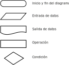
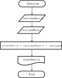
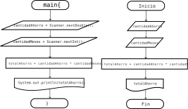

# Diagramas de flujo
Ya que los programas son algoritmos, y un algoritmo es básicamente una serie de pasos a seguir (como una receta de cocina), podemos representar los algoritmos visualmente usando figuras para saber qué es lo que hará el algoritmo.



Con estas *piezas* podemos crear nuestros primeros algoritmos, es decir programas.

## Planteamiento de problemas con diagramas de flujo.

Antes de empezar a escribr cualquier programa, es **muy** importante tener claro qué es lo que se quiere hacer, o resolver. Por ejemplo.

### Problema 1
*Calcular el ahorro total de $200 pesos cada mes durante 1 año.*

Podemos identificar algunos datos que servirán para crear otros datos. Podemos identificar el problema en 3 etapas.

**Datos conocidos:** Datos que se nos dan para resolver un problema.
 - $200
 - 1 mes
 - 1 año

**Procesos:** 

Operaciones a realizar con los datos como sumas, multiplicaciones, divisiones etc.
En este caso, debemos multiplicar los meses del año por el monto de ahorro.

**Resultado**

Saber en qué momento ya tenemos la respuesta al problema. En este caso la respuesta es $2400

Esta manera de dividir el problema puede ser a veces un poco difícil de ver ya que es mucho texto y en algoritmos más elaborados suele complicarse demasiado. Es por esto que podemos representar el problema planteado (y su solución) en un diagrama de flujo para entender qué es lo que hace el programa. En este problema el diagrama de flujo correspondiente sería:



Es mucho más fácil imaginar con dibujos que con texto :) Podemos ver el orden en el que se ejecutará el programa, esto es de arriba hacia abajo.

Empezamos con trapecios, que significan entrada de datos, por lo que le daremos a la computadora los datos *cantidadAhorro* y *cantidadMeses*. Después el cuadrado significa que haremos la operación de multiplicación de estos dos datos, teniendo el resultado en *totalAhorro* para finalmente mostrar en una salida el resultado obtenido.

Debemos entender que si queremos hacer un buen programa, debemos generalizarlo, es decir que pueda funcionar con cualquier monto de ahorro y cualquier cantidad de meses, no solamente $200 y 12 meses. Todo esto para que la computadora pueda hacer estas tareas automáticamente

**Todavía no hemos programado nada, esto es solo una representación visual para poder saber qué es lo que vamos a programar**

Antes de empezar a programar, debemos repasar algunos términos importantes.

- *Instruccion*: Una operación a realizar en un programa. Por ejemplo, sumar 2 números.
- *Algoritmo*: Conjunto de instrucciones de inicio a fin con pasos finitos para resolver un problema.
- *Programa*: Conjunto de algoritmos para crear software que se dedique a resolver sus propósitos.
- *Dato o valor*: Un número, booleano, caracter, una cadena etc.

- *Variable*: El nombre de una cajita donde guardaremos un dato *temporalmente*.

El valor puede ser *cualquier* cosa. Por ejemplo, podemos guardar:
 - Números enteros (-4, 0, 1000, etc.)
 - Números decimales (-0.23, 0.0, 10.32 etc)
 - Cadenas de carácteres ("Gordo Bachicha", "Pedro", "Rubik" etc)
 - Booleanos (true, false)
 - Otros objetos (lo veremos más adelante..)

Por lo que debemos guardar en variables los datos que debamos operar. Por otro lado, el nombre que le demos a la variable debe ser significativo siempre. Por ejemplo, *cantidadAhorro* significa que guardará la cantidad que se quiera ahorrar, o si queremos guardar la edad de alguien, podemos nombrar una variable *edad* para guardar el número de años que tiene. Es muy mala idea crear nombres de variables **NO** significativos. Si en lugar de *cantidadAhorro* se tuviera *cA* no nos da mucha información de qué es lo que guarda en esa variable el programa, aunque para el programa sea lo mismo leer de *cantidadAhorro* o *cA* pero como humanos no es tan fácil adivinar. Lo mismo pasa para los nombres de clases.

**NOTA** En Java, los nombres de variables *siempre*, *siempre*, *siempre* empiezan en minúsculas. 

Es muy probable que no quede claro de primeras todo el código escrito, sin embargo este se irá desvelando poco a poco a medida que se vaya avanzando el curso.

### Código
Crearemos un archivo que se llame *Ahorro.java* y lo abriremos para escribir lo siguiente. (todo símbolo por mínimo que parezca es de suma importancia)

```java
import java.util.Scanner;

public class Ahorro {

    public static void main (String[] args){

        Scanner input = new Scanner(System.in);

        double cantidadAhorro;
        int cantidadMeses;
        double totalAhorro;

        System.out.print("Ingresar la cantidad a ahorrar en punto decimal: ");
        cantidadAhorro = input.nextDouble();
        System.out.print("Ingresar la cantidad de meses a ahorrar: ");
        cantidadMeses = input.nextInt();
        
        totalAhorro = cantidadAhorro * cantidadMeses;

        System.out.print("El ahorro total es de: ");
        System.out.print(totalAhorro);
    }
}
```

Lo compilamos y, si hay errores, debemos verificar que caracter por caracter esté exactamente igual que como está aquí.
De lo contrario, lo ejecutamos con 

```bash
$ java Ahorro
```

El programa nos pedirá añadir una cantidad a ahorrar en punto decimal, y luego ingresar la cantidad de meses, un valor numérico, al final la salida del programa será:

```bash
$ java Ahorro 
Ingresar la cantidad a ahorrar en punto decimal: 200.0
Ingresar la cantidad de meses a ahorrar: 12
El ahorro total es de: 2400.0
```
### Explicación paso a paso.

Si te estás preguntando, ¿cómo es que el programa funciona?

Lo primero que tienes que saber, es que siempre, siempre, siempre la computadora no hará nada que no se le haya dicho que no haga. Todo el código lo sigue fielmente sin lugar a errores, entonces solo hay que entender que fue lo que hizo.

Recordatorio de que no se explicará a detalle y varios conceptos quedarán pendientes que se irán resolviendo al pasar el tiempo.

1. Embeces, necesitamos utilizar el código que alguien más ya programó, por ejemplo estamos usando *Scanner*, que funciona para leer datos desde la terminal.

```java
import java.util.Scanner;
```
2. En java, TODO programa, código, algoritmo debe ir dentro de una *clase*, o sea un texto como el siguiente.

```java
public class Ahorro {

}
```
El nombre de la clase no puede empezar con minúsculas ni números, y no puede tener espacios dentro. Utilizamos el *CamelCase* para poder *separar* palabras. Después pueden ir mayúsculas y minúsculas o números. Además, debe abrir y cerrar con llaves {}.

3. Todo programa que se puede *ejecutar* debe tener de un *método* main dentro de la clase, y debe ser exactamente así:
```java
    public static void main (String[] args){

    }
```

El *método* main es el primero que se ejecuta al momento de correr nuestro programa. Más adelante veremos qué signfica cada cosa, de que public o void y así, pero todo tiene su razón de ser. Los métodos son porciones de código que le dan forma a nuestro programa.

Todo lo que sigue va adentro del main, así se ejecuta línea por línea de arriba hacia abajo. Es importante que quede claro estos 3 pasos anteriores. Lo siguiente es una pequeña explicación de lo que realmente se ejecuta.

4. Creamos un objeto de la clase *Scanner* para poder leer datos por la terminal.
```java
        Scanner input = new Scanner(System.in);
```
En java, los objetos son tipo *programas* (muy informalmente) para poder hacer cosas, por ejemplo este objeto nos permite leer datos del teclado por la terminal. Hay otros objetos que nos permiten conectarnos a un servidor en red, crear videojuegos, o mostrar una imagen en el explorador.

5. Creamos las variables donde guardaremos los datos que conocemos temporalmente.
```java
        double cantidadAhorro;
        int cantidadMeses;
        double totalAhorro;
```
Una variable *siempre* debe de tener un tipo de dato definido, en este caso tenemos 2 tipos de dato: **double** y **int**.

- **double** para números decimales. Los decimales son útiles cuando hablamos de dinero, peso, distancias, tiempo etc.

- **int** para números enteros. Los números enteros son útiles cuando hablamos de cantidades que no se pueden dividir, por ejemplo contar ovejas, la edad, o identificadores. 

6. Mostramos un mensaje pidiendo un valor, y luego guardamos el valor variable a cantidadAhorro. 
```java
        System.out.print("Ingresar la cantidad a ahorrar en punto decimal: ");
        cantidadAhorro = input.nextDouble();
```
Es importante el mensaje, de otra forma no sabríamos qué información meter dentro del programa, podría ser cualquier cosa. El que sea variable significa que puede ser cualquier valor de punto decimal (de 0.0, -3.15, 234.21321 etc). Entonces nuestro programa no solo podría calcular el ahorro para $200, sino para **cualquier** cantidad que queramos ahorrar a futuro! Prueba ahora con otros valores!

La otra línea es justamente la asignación de lo que escribimos en la terminal adentro de nuestro programa. Como input es un objeto de la clase Scanner que alguien más programó, ese alguien hizo el método *nextDouble()* que sirve para leer números con punto decimal desde la terminal. 


7. Hacemos lo mismo para guardar los meses.
```java
        System.out.print("Ingresar la cantidad de meses a ahorrar: ");
        cantidadMeses = input.nextInt();
```
8. La carnita del programa. Teniendo finalmente los datos conocidos que son *cantidadAhorro* y *cantidadMeses* procedemos a efectuar la operacion de multiplicación, ya que al final de cuentas, la multiplicación es una suma realizada **n** veces y es justo lo que buscamos

```java
        totalAhorro = cantidadAhorro * cantidadMeses;
```
9. Cerramos nuestro objeto que lee desde la terminal, es decir ya no leeremos más cosas de la terminal nunca más con este objeto.
```java
        input.close();
```
Es importante cerrar el canal de comunicación entre la terminal y nuestro programa, ya que si no lo cerramos, podríamos tener *leaks* o que el resultado no sea el esperado.

10. Finalmente mostramos en la terminal el mensaje que se encuentra dentro de *"comillas"*, además de que mostramos también el resultado de la operación.
```java
        System.out.print("El ahorro total es de: ");
        System.out.println(totalAhorro);
```
System.out.print() es un método para mostrar, imprimir en la terminal. Puedes suponer que es como una impresora la pantalla, y cada nueva información que se imprima, se va agregando a la terminal hacia arriba, como una impresora va sacando la información poco a poco.


### Relación
Podemos ver una relación entre el diagrama de flujo y el programa en general. Algunas partes están en el programa como tal, y otras no se especifican.



Por ejemplo, nunca especificamos en el diagrama la definición de variables
```java
        double cantidadAhorro;
        int cantidadMeses;
        double totalAhorro;
```

Tampoco la creación del objeto Scanner
```java
        Scanner input = new Scanner(System.in);
```

Ni mucho menos los mensajes de qué valores ingresar o cuando ya se tiene el resultado:

```java
        System.out.print("El ahorro total es de: ");
```

Es parte de la resolución del problema saber qué cosas adicionales necesitamos para que nuestro programa pueda resolver el problema planteado. Una cosa es el problema, y otra el cómo resolver el problema en java. 

Por ejemplo, un problema puede ser, pasar de un texto a voz. El problema es claro, qué tenemos de entrada, y qué queremos de salida. Pero en donde se imagina, desarrolla y aterriza el problema es exactamente en el código, aquí debemos encontrar un puente entre lo que queremos y lo que entiende la computadoras, es decir, instrucciones paso a paso. Esta parte es la que estaremos practicando 