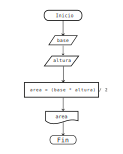
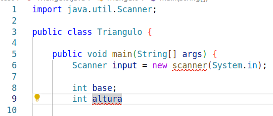

# Errores a la hora de programar

Es probable que el programa anterior no te haya funcionado a la primera, ¿por qué?

No hay nada de diferente entre un lenguaje natural como el español con un lenguaje de programación como *Java*. Ambos deben de cumplir ciertas reglas para que la comunicación sea exitosa.

En general, hablando de lenguajes tenemos 3 propiedades específicas:

1. **Sintaxis**: Son reglas para decir cómo se escriben las palabras y en qué orden. Por ejemplo la estructura 
*Sujeto, verbo predicado* por ejemplo 

*Ýo como unos tacos dorados de pollo.* ✔

*pollo. unos Yo tacos dorados como de* ✗

En programación, una buena sintaxis sería:

```java
    int x = 13;
    if ( x > 0){
        System.out.println("x es mayor a 13");
    }
``` 
✔
Y donde no:

```java
    while) 
        por favor haz mi práctica!!
        system.out[hola + 1)
    }
```

2. **Semántica**: El significado que tiene cada palabra del lenguaje y que tenga sentido la idea que se dice. Por ejemplo:

*Era un gobierno fascista* ✔

*Ayer iré a hablar con mi gato ha corrido desde 4 semanas siguientes* ✗

No debemos confundir tiempos presente, futuro, pasado perfecto sin sentido.

*Eta koshka nie bezhit* ✗

Esta linea es ruso, pero como no sabemos ruso no podemos entender qué dice. La semantica también depende del lenguaje. Por ejemplo *orange* en español no existe, pero en inglés sí.


En programación la sintaxis sería:

```java
    int edad = 25; ✔  
``` 

```java
    double promedio = "Hola mundo"; ✗
```

3. **Pragmática** : El significado que se le da a la oración dependiendo del contexto:

*El perro de tu tío es muy bravo* ✔

*Que pedo!* ✔

Esta última regla no aplica directamente en lenguajes de programación, ya que una computadora siempre hará exactamente lo que se programó para hacer. No es posible que el siguiente código:

```java
    boolean esGrande = 5 > 9;
    System.out.println(esGrande);
```

imprima una cadena, o un número. Solo puede, y debe imprimir el booleano "esGrande", o sea `false`

Claramente un lenguaje natural es mucho más dificil que un lenguaje de programación porque tiene excepciones de lenguaje, conjugación de verbos, personas, y son muchas palabras y vocabulario que memorizar!

En java, solo hay que aprender como unas 20 palabras y cómo es que se deben seguir las palabras para que tenga sentido, por lo que CUALQUIER PERSONA puede aprender a programar, ya que aprendió antes su lengua nativa y es un lenguaje al final de cuentas.

Crearemos a propósito un programa con errores de sintaxis para que puedas ver cómo es que el compilador nos ayuda a detectarlos!
El programa calculará el área de un triángulo, el diagrama de flujo será como el siguiente.



### Errores sintácticos

Crearemos el siguiente programa Triangulo.java

```java
import java.util.Scanner;

public class Triangulo {
    
    public static void main(String[] args) {
        Scanner input = new scanner(System.in);
        
        double base;
        int altura

        System.out.print("Ingrese la base del triángulo: );
        base = input.nextInt;

        System.out.print("Ingrese la altura del triángulo: ");
        altura = input.nextInt;

        int area  base + altura;

        system.out.println("El área de triángulo es: " + area);
        input close();
    }
}
```

Aquí hay demasiados errores, cubriremos los más comunes. Tratamos de compilar con javac, y en la consola nos apareceran al menos un error:

```bash
$ javac Triangulo.java 
Triangulo.java:9: error: ';' expected
        int altura
                  ^
Triangulo.java:11: error: unclosed string literal
        System.out.print("Ingrese la base del triángulo: );
                         ^
Triangulo.java:17: error: ';' expected
        int area  base + altura;
                ^
Triangulo.java:17: error: not a statement
        int area  base + altura;
                       ^
Triangulo.java:20: error: ';' expected
        input close();
                   ^
5 errors
```

El compilador ha sido programado para que nos diga una idea de qué es lo que puede estar fallando. A veces el mensaje es muy claro, otras veces no tanto. Además nos dice en qué archivo y en qué línea de código de ese archivo se encuentra el error, justamente en donde señala la flechita. Por ejemplo, el error


```bash
Triangulo.java:9: error: ';' expected
        int altura
                  ^
```

Dice que en el archivo Triangulo, en la línea 9 está el error y nos dice que se esperaba un **;**



Corregimos esa linea agregando **;** al final, guardamos y volvemos a compilar.


```bash
$ javac Triangulo.java 
Triangulo.java:11: error: unclosed string literal
        System.out.print("Ingrese la base del triángulo: );
                         ^
Triangulo.java:17: error: ';' expected
        int area  base + altura;
                ^
Triangulo.java:17: error: not a statement
        int area  base + altura;
                       ^
Triangulo.java:20: error: ';' expected
        input close();
                   ^
4 errors
```

Ahora son menos errores! Vamos con el siguiente error

```bash
Triangulo.java:11: error: unclosed string literal
        System.out.print("Ingrese la base del triángulo: );
                         ^
```

Nos dice que el caracter `"` no cierra nunca. Es decir debemos cerrar el mensaje dentro de " ".
Ponemos dobles comillas al final de los 2 puntos del mensaje  como "Ingrese la base del triángulo: " ✔  

Corregimos, guardamos y volvemos a compilar, ahora tenemos todavía menos errores!

```bash
$ javac Triangulo.java 
Triangulo.java:17: error: ';' expected
        int area  base + altura;
                ^
Triangulo.java:17: error: not a statement
        int area  base + altura;
                       ^
Triangulo.java:20: error: ';' expected
        input close();
                   ^
3 errors
```

**Nota**: No por tener más errores significa que estamos más lejos de corregir el programa. A veces nos pueden aparecer como 20 errores, pero todos son ocasionados por una {} que no cerró, o porque nos faltó un `;`, o no pusimos un `=`. Está decretado que este es un evento canónico entre los estudiantes de primeros semestres :)


El tercer error fácilmente podríamos poner `;` para poder solucionarlo como el primer caso.


```bash
Triangulo.java:17: error: ';' expected
        int area  base + altura;
                ^
```

pero lo que hace falta es en realidad es la asignación de *base + altura* al valor *area*, por lo que el mensaje del compilador aquí no nos ayuda mucho porque generaríamos más errores si ponemos `;`. Corregimos entonces como
```java
        int area = base + altura;
```

Con esta corrección, hemos matado 2 pájaros de un tiro. Guardamos y compilamos nuevamente. Ahora tenemos solamente 1 error más:

```bash
$ javac Triangulo.java 
Triangulo.java:20: error: ';' expected
        input close();
                   ^
1 error
```

Aunque espera `;` lo que en realidad queremos es utilizar el método close() como el ejercicio pasado, por lo que si vemos detalladamente solamente necesitamos un `.` entre input y close().

Saber cómo y qué corregir en donde no hay de otra más que intentarlo y aprendiendo de las fallas :( Dicen que para poder hacer algo bien debes fallar otras 100 veces. Al final todo lo que aprendes, nadie te lo quitará :) 

Con esto terminamos los errores de sintaxis :) 
Nuestro programa sigue teniendo errores :(

### Errores semánticos 

Aunque hemos resuelto 5 errores, al volver a compilar seguiremos teniendo más errores :( No significa que lo que hayamos hecho antes no haya servido de nada, sino que Java se va primero por errores sintácticos, y cuando ya no haya esos errores, verifica errores semánticos. Por lo que ahora tenemos los siguientes errores semánticos:

```bash
$ javac Triangulo.java 
Triangulo.java:6: error: cannot find symbol
        Scanner input = new scanner(System.in);
                            ^
  symbol:   class scanner
  location: class Triangulo
Triangulo.java:12: error: cannot find symbol
        base = input.nextInt;
                    ^
  symbol:   variable nextInt
  location: variable input of type Scanner
Triangulo.java:15: error: cannot find symbol
        altura = input.nextInt;
                      ^
  symbol:   variable nextInt
  location: variable input of type Scanner
Triangulo.java:17: error: incompatible types: possible lossy conversion from double to int
        int area = base + altura;
                        ^
Triangulo.java:19: error: package system does not exist
        system.out.println("El área de triángulo es: " + area);
              ^
5 errors
```

El primero es porque no pusimos *scanner* en mayúscula. Recordemos que los nombres de clases siempre, siempre empiezan en mayúsculas. En realidad es el constructor, que se tiene que llamar *exactamente igual* que la clase, o el objeto, en este caso el objeto es **Scanner**, no *scanner*. Justo nos dice que no encuentra la clase *scanner* porque la clase se llama *Scanner*.
```bash
Triangulo.java:6: error: cannot find symbol
        Scanner input = new scanner(System.in);
                            ^
  symbol:   class scanner
  location: class Triangulo
```

Los siguientes 2 errores son similares. input es un objeto, *muy informalmente* un programa que hace cosas. Podemos pensar que el `.` es un caracter para decir qué quieres que haga ese objeto, en este caso queremos que ejecute el subalgoritmo *nextInt()*, pero en java, todo comportamiento/algoritmo tiene al final un par de paréntesis (), de lo contrario es una variable con valor fijo, y no un código, o conjunto de instrucciones.

Por lo que solamente debemos decir que estamos *llamando* al método (subalgoritmo) *nextInt()*, no *nextInt*
```bash
Triangulo.java:12: error: cannot find symbol
        base = input.nextInt;
                    ^
  symbol:   variable nextInt
  location: variable input of type Scanner
Triangulo.java:15: error: cannot find symbol
        altura = input.nextInt;
                      ^
  symbol:   variable nextInt
  location: variable input of type Scanner
```

El siguiente error tiene que ver con que no podemos guardar un valor de punto decimal, en un valor de tipo entero porque perderíamos información, o truncamos el número.

```bash
 symbol:   variable nextInt
  location: variable input of type Scanner
Triangulo.java:17: error: incompatible types: possible lossy conversion from double to int
        int area = base + altura;
                        ^
```

Por ejemplo, la suma 

4 + 5.00099 = 9.00099

nos fijamos que el resultado es de punto decimal, no de valor entero, o sea no podemos hacer

4 + 5.00099 = 9

Por lo que el resultado que guardamos en area no debe ser tipo `int` (sin punto decimal) sino que debe ser de tipo double (con punto decimal)


Finalmente, System también es una clase y nuevamente está empezando en minúscula!  Solamente debemos poner mayúscula.
```bash
Triangulo.java:19: error: package system does not exist
        system.out.println("El área de triángulo es: " + area);
              ^
```

Después de corregir los errores semánticos vamos a poder compilar sin problema nuestro archivo.

Es importante aclarar que no debes entender qué tienes que hacer en cada caso, este mini poder se va adquiriendo a lo largo de la programación, así que solamente programa y lo adquirirás!


Finalmente ejecutamos nuestro programa, y, todavía no estamos excentos de errores! Hay muchas cosas que pueden estar fallando!

### Errores lógicos

Este tipo de errores es más difícil de detectar ya que no son capturados por el compilador. Y además tiene que ver que recibamos lo que esperamos recibir y no datos incorrectos.

Si ejecutamos una vez nuestro programa, y le damos 2 números, aleatorios, por ejemplo 5 y 6, el resultado es el siguiente.

```bash
$ java Triangulo 
Ingrese la base del triángulo: 5
Ingrese la altura del triángulo: 6
El área de triángulo es: 11.0
```

El programa termina correctamente, pero el valor que nos da, no es el esperado, puesto que la fórmula para calcular el área de un triángulo es (base * altura)/ 2;

Por lo que (5*6)/2 = 30/2 = 15 es diferente de 11!
Este tipo de errores se les suele atacar con algo llamado *pruebas unitarias*, es decir, probamos con valores conocidos esperando resultados conocidos para saber si está bien el programa o no.

Corregimos entonces nuestro programa para que calcule el área correctamente.

```bash
$ java Triangulo 
Ingrese la base del triángulo: 5
Ingrese la altura del triángulo: 6
El área de triángulo es: 15.0
```

Estos errores salen a la luz cuando confiamos que nuestro programa hará lo que tiene que hacer pero no lo hace, como por ejemplo ponerle play a un video y que no pase nada, o que la suma de calificaciones nos de un número negativo!

Todavía hay un último tipo de error y es de esos errores que son difíciles de determinar.

### Errores en tiempo de ejecución

Estos son los errores son cuando el usuario se quiere pasar de listo, o nuestro programa no es lo suficientemente *robusto* para procesar cualquier entrada, por ejemplo, ejecutemos nuestro programa, pero en lugar de darle números, le pasamos una palabra

```bash
shosho@shosholanda:~/Documentos/Proyectos/java-from-zero/test$ java Triangulo 
Ingrese la base del triángulo: Pichu
Exception in thread "main" java.util.InputMismatchException
        at java.base/java.util.Scanner.throwFor(Scanner.java:939)
        at java.base/java.util.Scanner.next(Scanner.java:1594)
        at java.base/java.util.Scanner.nextInt(Scanner.java:2258)
        at java.base/java.util.Scanner.nextInt(Scanner.java:2212)
        at Triangulo.main(Triangulo.java:12)
```
Nos mostrará algo de **Exception**, errores que proceden de una entrada no definida, en este caso cuando el usuario (nosotros) le pasamos en lugar de un número algo que no sea número.

También es posible que nuestro mismo programa genere estados inconsistentes si es que no lo hemos programado bien, por ejemplo el clásico pantallazo azul de windows es un error en tiempo de ejecución, también conocidas *RuntimeException*. O también que un programa se cierre inmediatamente es parte de errores en tiempo de ejecución y finalmente que un programa no *termine* cuando debería terminar también es un error de tiempo de ejecución.